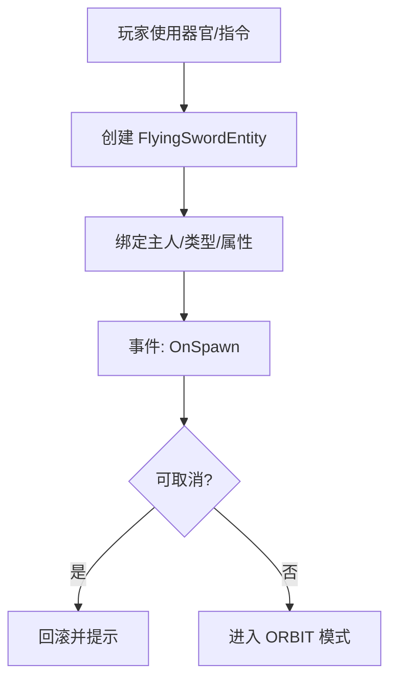
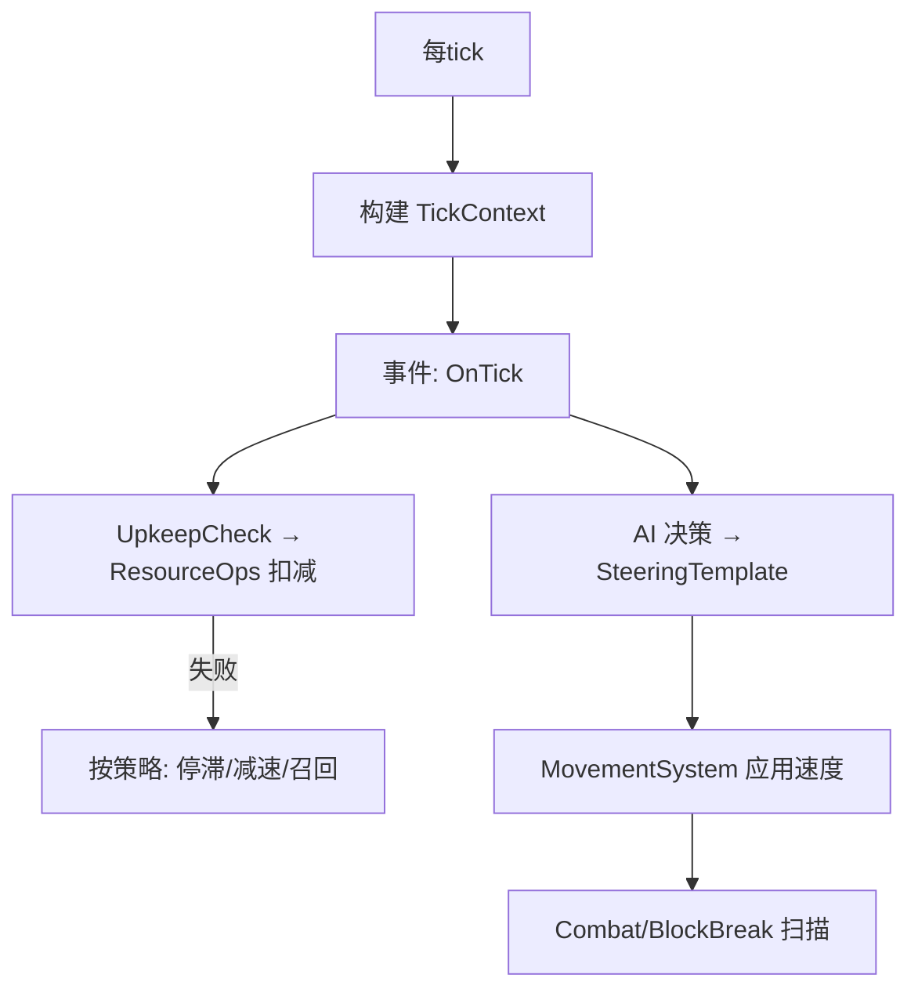
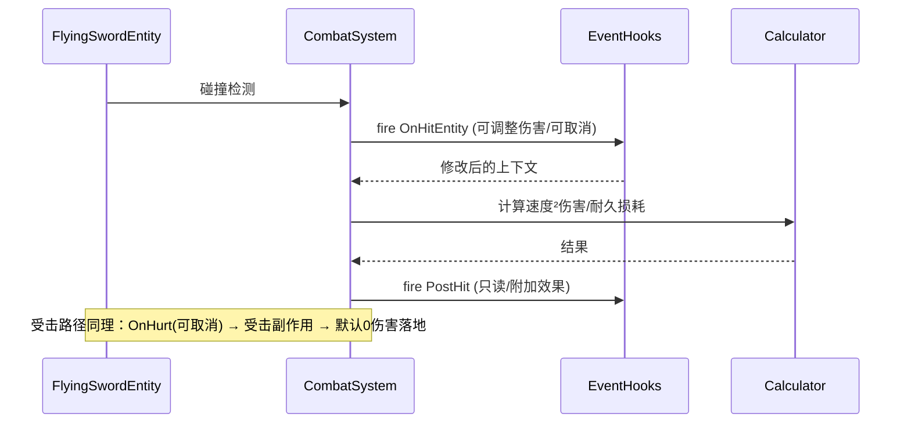
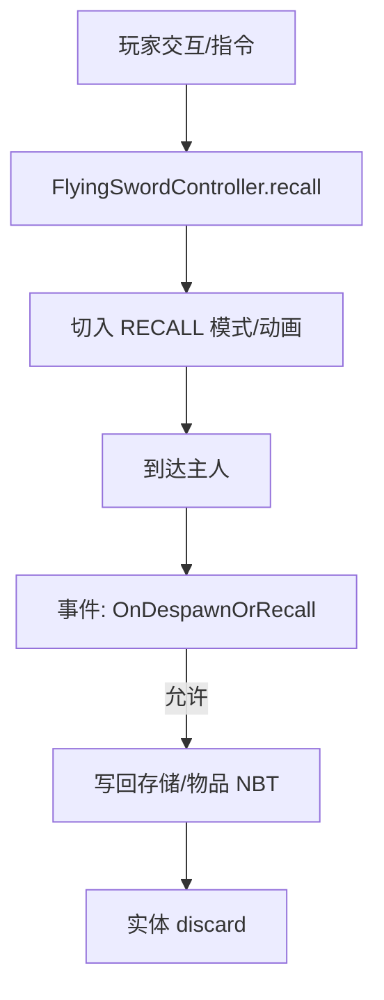

# 飞剑模块重构｜需求方案（Requirements Specification)

> 目标：以“核心最小 + 事件驱动 + 可选扩展”为原则，裁剪与重构飞剑系统，确保功能不回退、结构更清晰、便于扩展与测试。

## 功能列表与说明（Feature List）
- 核心实体与状态
  - 飞剑实体与属性：等级、经验、耐久、速度、类型、分组、可召回标记。
  - 主人绑定：支持玩家/非玩家；实体端为镜像，真源在附件/存储侧。
- AI 模式与目标
  - 模式：环绕（ORBIT）、防守（GUARD）、出击（HUNT）、悬停（HOVER，可选）、召回（RECALL）。
  - 目标：目标选择/保持/丢失的统一流程（含高优先级覆盖）。
- 运动与转向
  - 模板化转向（SteeringTemplate）：根据意图产出速度指令，系统统一应用。
  - 平滑朝向：渲染侧抖动抑制（现有 Slerp 逻辑保留）。
- 战斗与防御
  - 命中：速度²伤害、命中后附加效果、事件前置/后置钩子。
  - 受击：可取消/改伤、触发折返/虚弱等效果（默认钩子保留）。
- 破坏方块（可选）
  - 破块尝试/成功的前后事件；可按模式与速度阈值控制。
- 维持消耗与资源
  - 统一由 ResourceOps 扣减，支持玩家/非玩家策略；失败策略（停滞/减速/召回）。
- 召回与存储
  - 控制器统一召回；回写物品 NBT；玩家离线自动入库。
- 指挥与交互
  - 基础指令：群组、模式切换、目标标记、召回。
  - TUI 可选开关；默认文本提示降级。
- 事件系统
  - 已有：Spawn/Tick/Hit/Hurt/BlockBreak/Interact/Despawn。
  - 待补：ModeChange、TargetAcquired/Lost、UpkeepCheck、PostHit、BlockBreakAttempt、ExperienceGain/LevelUp。
- 配置与诊断
  - 功能开关：高级轨迹、扩展意图、集群、TUI、Gecko/覆盖。
  - 指标与调试：目标查询次数、命中率、决策日志（可开关）。

## 用例图（Use Case Diagram）

```mermaid
flowchart LR
  %% Actors
  A[玩家 Player]
  B[服务器管理员 Admin]
  C[扩展模块<br/>(器官/道痕/技能)]
  D[服务器系统<br/>(资源/冷却)]

  %% System boundary
  subgraph FS[飞剑系统]
    UC1([召唤/生成飞剑])
    UC2([切换AI模式])
    UC3([标记/清除目标])
    UC4([召回/入库])
    UC5([查看状态])
    UC6([命中与附加效果])
    UC7([受击与护挡])
    UC8([破坏方块])
    UC9([维持消耗扣减])
    UC10([回写物品NBT])
    UC11([事件订阅/扩展])
    UC12([功能开关与参数])
  end

  %% Relations
  A -- 使用 --> UC1
  A -- 使用 --> UC2
  A -- 使用 --> UC3
  A -- 使用 --> UC4
  A -- 使用 --> UC5

  C -- 订阅/影响 --> UC6
  C -- 订阅/影响 --> UC7
  C -- 订阅/影响 --> UC11

  D -- 提供资源/冷却 --> UC9
  D -- 触发存取 --> UC10

  B -- 配置/调参 --> UC12
  B -- 维护/排障 --> UC5
```

## 用户故事（User Stories）
- 作为玩家，我希望一键召回所有飞剑，并自动入库，以便快速撤离或跨维度移动。
- 作为玩家，我希望在防守模式下优先保护自己或指定实体，以便降低被围攻风险。
- 作为玩家，我希望看到清晰的飞剑状态（等级、耐久、速度、目标），以便做出切换与修理决策。
- 作为服务器管理员，我希望通过配置开关关闭高级轨迹与TUI，以降低服务器压力与学习成本。
- 作为服务器管理员，我希望在玩家下线时自动收拢飞剑，避免实体遗留造成负载与丢失。
- 作为扩展模块开发者，我希望拦截命中/受击事件以施加 DoT/反应效果，而不修改飞剑核心代码。
- 作为扩展模块开发者，我希望在 Upkeep 扣减前获得回调以改变倍率，或短时免疫维持消耗。

## 业务流程图（Business Flows）

### 流程A：召唤/生成与初始化


### 流程B：Tick 主循环（服务端）


### 流程C：命中与受击（前后事件）


### 流程D：召回与入库


## 验收标准（Acceptance Criteria）
- 事件链：OnSpawn/OnTick/OnHitEntity/OnHurt/OnBlockBreak/OnInteract/OnDespawn 可被外部钩子订阅并短路。
- 基础模式：ORBIT/GUARD/HUNT 可用且切换无异常；RECALL 正常结束并入库。
- 资源一致：维持消耗只在唯一入口扣减；失败策略生效；无“负冷却/负资源”。
- 数据一致：召回/离线后飞剑状态正确写回；重新召唤继承属性与模型。
- 性能：默认开关关闭时，实体 tick 行为稳定；黑板/缓存减少重复扫描（可选目标）。

---

> 说明：本需求文档聚焦“做什么与怎么流转”，实现细节在技术框架与实施计划中给出。

