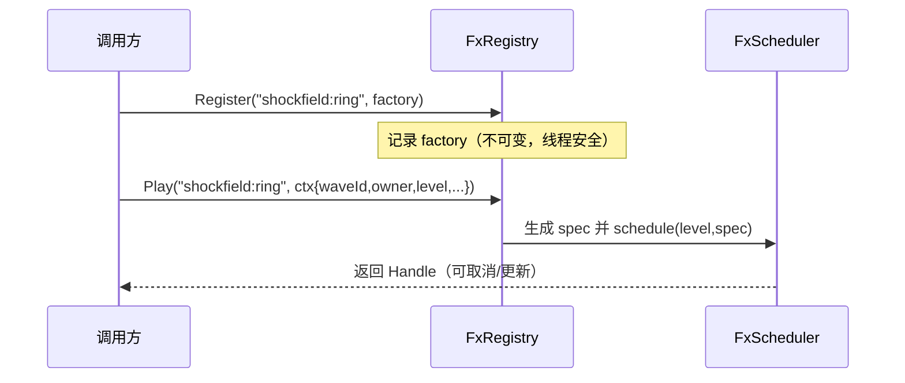
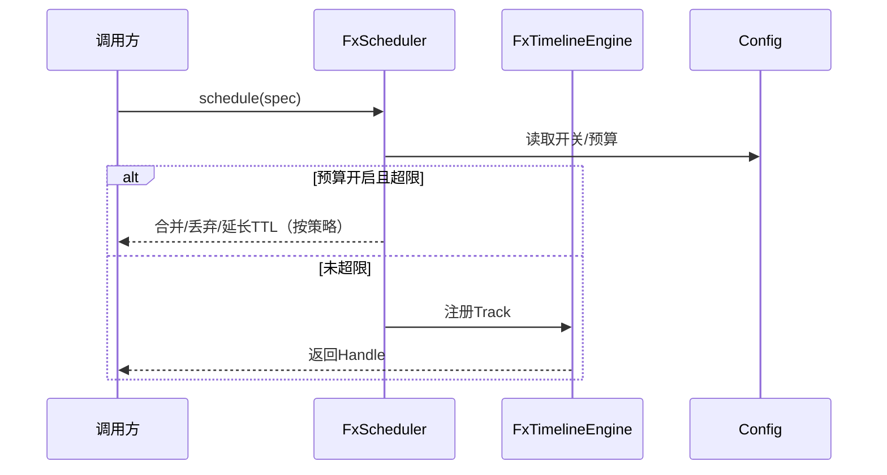
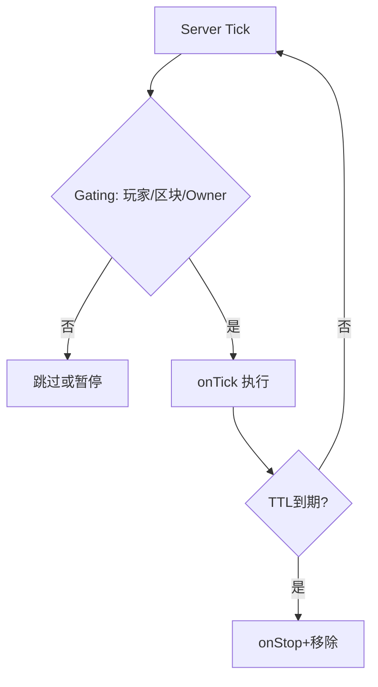

# FxEngine 时间线系统 · 需求方案（含预算控制）

> 目标：为 Shockfield 等系统提供“可持续运行”的服务端 FX 时间线能力（Timeline/Track），具备可配置的预算控制与限流，默认关闭，按需启用。尽量减少代码示例，专注需求与流程。

## 功能列表与描述

- 时间线（Timeline）与轨道（Track）
  - 支持 onStart/onTick/onStop 的生命周期回调；按 tickInterval 驱动，持续 TTL。
  - 可绑定锚点：固定位置、跟随实体、跟随 Wave 状态（半径/振幅）。
- FX 注册中心（Registry）
  - 通过 ID 先行 Register(...) 一类可复用的 FX 方案（以 factory/模板形式定义）。
  - 在任意回调/任意上下文使用 Play(...) 调用并实例化（传入 waveId/ownerId/位置等上下文）。
- 预算控制（默认关闭，可配置）
  - 每级别上限：每 Level 活跃 FX 数量上限（per-level cap）。
  - 每主人上限：同一 owner（玩家/实体）的 FX 上限（per-owner cap）。
  - 超限策略：合并同类（mergeKey）、延长 TTL、或丢弃新请求（可配）。
- 限流与合并
  - mergeKey 合并策略；tickInterval 控制频率；去抖（debounce）与窗口（window）可选。
- 门控（Gating）
  - 仅在有玩家接近、区块已加载、Owner 存活时运行；否则跳过或暂停。
- 生命周期管理
  - 状态：CREATED → STARTED → RUNNING → STOPPING → STOPPED；Stop 原因归档（TTL、移除、取消等）。
- 观测与运维
  - 轻量日志（默认 INFO 以下静默）；计数器（活跃数、丢弃数、合并数）；可选 Debug 开关。

## 用例图（Mermaid 近似）

```mermaid
flowchart LR
  Actor[FX调用方
  (ShockfieldFxService/行为)] -->|schedule(spec)| Scheduler[FxScheduler]
  Scheduler -->|校验配置/预算| Config[(FxEngine Config)]
  Scheduler -->|登记/合并| Engine[FxTimelineEngine]
  Engine -->|每tick onTick| Track[FxTrack]
  Track -->|采样| Anchor[锚点: 位置/实体/Wave]
  Engine -->|预算超限/Stop| Actor

  Actor -->|register(id,factory)| FxRegistry[FxRegistry]
  Actor -->|play(id,ctx)| FxRegistry
  FxRegistry -->|构建spec| Scheduler
```

## Register/Play 流程（Mermaid）



## 用户故事（User Stories）

- 作为 FX 实现者，我希望能启动“跟随波半径扩张的环纹 FX”，并在 5 秒内按 2 tick 一次的频率更新。
- 作为服务器运维，我希望能开启预算控制，限制每个 Level 最多 256 个 FX、每个玩家最多 16 个 FX，避免高峰期卡顿；默认关闭，必要时启用。
- 作为性能负责人，我希望 FX 引擎在区块未加载或无人附近时自动暂停/跳过计算，减少浪费。

## 业务流程（Mermaid）

### A. 提交流程（含预算与合并）



### B. Tick 执行与门控



## 关键需求（摘要）

- 预算控制开关与阈值可配置；默认关闭。
- 每 Level/每 Owner 上限与合并策略可配置。
- 统一生命周期回调；onTick 间隔可配置（tickInterval）。
- 门控条件：玩家半径、区块加载、Owner 存活；策略为跳过或暂停（可选）。
- 日志与计数器轻量化；Debug 开关默认关闭。
