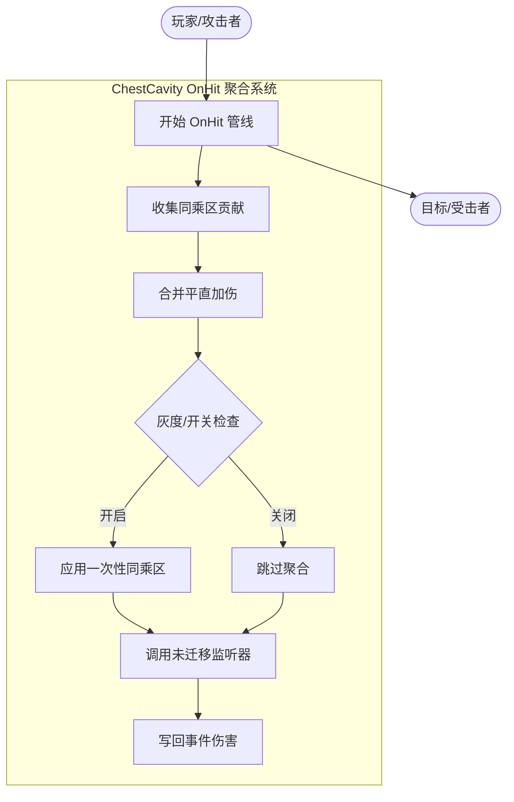
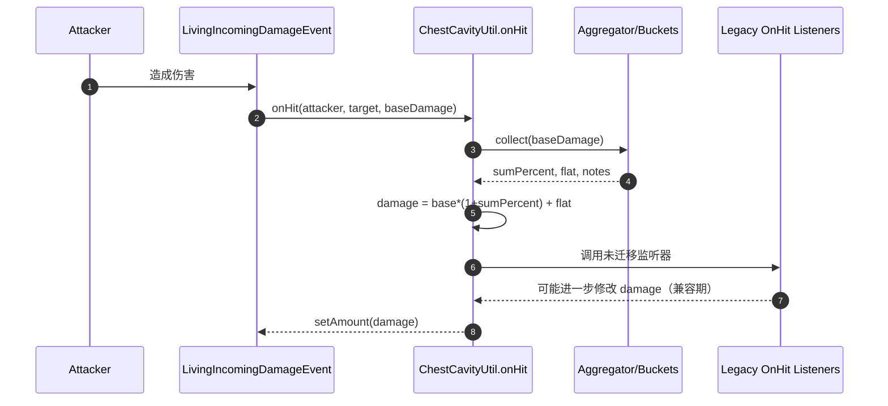

# OnHit 聚合接口与伤害桶（Damage Buckets）需求方案

本文档定义在不侵入具体器官实现的前提下，为 OnHit 阶段新增“聚合接口与伤害桶”的需求与流程。目标是将多来源的百分比增伤统一进同一乘区，减少“独立乘区连乘”带来的数值膨胀，同时保持对旧有监听器的兼容与灰度切换能力。

## 目标与范围
- 目标
  - 引入“聚合式 OnHit 伤害计算”，将多条被动/状态/领域产生的“百分比增伤”合并为一个同乘区（sum 后一次性生效）。
  - 保持与现有 `OrganOnHitListener` 生态兼容，可灰度开启/关闭；不强制一次性迁移。
  - 支持“平直加伤（flat）”“额外命中（独立附加伤害）”与“副作用（打标签、粒子/音效）”，但不改变其定义。
- 非目标
  - 不在本方案内定义任何具体器官/技能的迁移与重写。
  - 不改变 `IncomingDamage`（受击减伤）流程和顺序。
  - 不改变 DoT/Reaction 引擎的行为与顺序。

## 功能列表与描述
- 同乘区聚合
  - 将所有“声明为同乘区百分比”的贡献相加：`damage' = damage * (1 + sumPercent)`。
  - 同乘区只应用一次，发生在 OnHit 流程早期、在旧接口回调之前。
- 平直加伤（Flat）
  - 汇总 flat 值：`damage' = damage' + flatTotal`。
  - 典型用于“基于效率的固定额外伤害”，不进入百分比乘区。
- 兼容旧接口（Legacy Bridge）
  - 聚合后仍调用未迁移监听器，确保功能不丢失。
  - 支持“识别已迁移回调并跳过二次结算”的机制（基于标识或注册表），避免重复增伤。
- 灰度与开关
  - 全局配置开关：启用/禁用“统一乘区聚合”。
  - 调试开关：在日志或 HUD 输出聚合前/后关键数值（默认关闭）。
- 容错与边界
  - 伤害下限钳制为 `>= 0`；`NaN/∞` 输入视为 0 处理并记录一次性告警（防刷屏）。
  - BYPASS 语义保持：`BYPASS_ORGAN_HOOKS` 等标签应直接跳过聚合流程。

## 用例图（Mermaid）

## 用户故事（User Stories）
- 作为数值设计者，我希望多条“百分比增伤”进入同一乘区，这样可控整体成长曲线，避免意外膨胀。
- 作为工程师，我希望逐步迁移旧监听器到新接口，并在迁移完成前通过灰度保证线上稳定。
- 作为玩家，我希望同类被动的叠加结果稳定且可预期，而不是因顺序差异导致数值波动。
- 作为调试者，我希望在需要时查看本次命中的聚合明细，快速定位异常来源。

## 业务流程（Sequence）

## 非功能性需求
- 性能：聚合为 O(n) 扫描，n 为参与本次回调的监听器数量，常数项低；默认不开启日志。
- 可测试性：提供纯逻辑单元测试切面，脱离 Minecraft 实体即可验证核心聚合函数。
- 可维护性：数据结构与接口定义应自解释、字段名统一，便于后续迁移器官接入。

## 里程碑验收
- M1：引入聚合接口与桶，默认关闭；旧功能无差异。
- M2：开启开关后，存在至少一个“示例贡献者”进入同乘区，测试覆盖通过。
- M3：文档与调试说明到位，准备迁移阶段（不包含迁移实施）。

