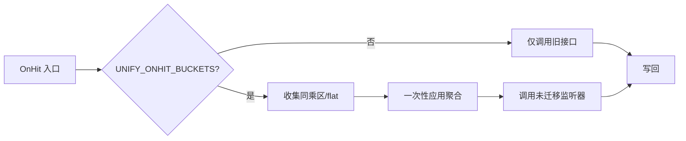

# OnHit 聚合接口与伤害桶 技术框架方案（KISS）

本方案在不引入新依赖的前提下，以最小侵入对 `ChestCavityUtil.onHit` 增加“聚合阶段”。

## 架构概览
- 关键构件
  - AggregationContext（仅文档名，具体类名后续定稿）：承载一次命中的临时状态。
    - baseDamage: float
    - sameBucketPercent: double（同乘区总和，单位用 0.15 表示 +15%）
    - flatBonus: float（平直加伤总和）
    - notes: List<String>（调试用，可选）
  - OnHitModifier（聚合接口，文档名）：声明贡献到“同乘区/平直加伤/副作用”的能力；不直接改写 damage。
  - LegacyBridge：识别已迁移监听器，避免二次增伤；保留旧监听器链路。
  - Config Toggle：全局开关 `UNIFY_ONHIT_BUCKETS` 与 `DEBUG_ONHIT_AGGREGATION`。

## 执行时序
1) 事件入口：`OrganDefenseEvents.onLivingIncomingDamage`
2) 进攻方链：`ChestCavityUtil.onHit`
3) 阶段一（聚合）：扫描实现 OnHitModifier 的监听器，调用其 `contribute(ctx, inputs)` 填充 `sameBucketPercent/flatBonus` 与副作用。
4) 应用聚合：`damage = damage * (1 + sameBucketPercent) + flatBonus`（仅一次）。
5) 阶段二（兼容）：对未迁移的 `OrganOnHitListener` 继续调用 `onHit(..., damage)`；若检测到“已迁移监听器”，则跳过它的旧接口。
6) 写回事件伤害。

## 接口说明（无代码，仅约定）
- OnHitModifier（聚合接口）
  - 方法语义：`contribute(ctx, inputs)`
    - inputs：包含 `DamageSource/attacker/target/cc/organ/baseDamage` 的只读快照
    - 行为：
      - 当需要“同乘区百分比增伤”时，向 `ctx.sameBucketPercent` 累加（例如 +0.2）
      - 当需要“平直加伤”时，向 `ctx.flatBonus` 累加
      - 可同步执行副作用（例如打 Reaction 标签/粒子），但不得直接改写事件伤害
  - 幂等性：单次命中仅调用一次；实现端需自保不重复计数。

- LegacyBridge（识别与跳过）
  - 目的：避免“同一行为”既通过新接口贡献，又在旧接口二次乘伤。
  - 机制：
    - 注册表：聚合阶段记录“已参与聚合”的监听器 Key（如类名/常量 ID），兼容阶段遇到相同 Key 则跳过。
    - 或：旧接口实现收到 `inputs.marker` 主动早退（推荐）。

## 关键设计取舍
- 同乘区仅一次：简化数值心智模型，可预期；需要迁移期的跳重保护。
- 旧接口保留：最大限度保护现网稳定；迁移自主节奏。
- 不改变受击减伤顺序：保持玩家直觉与既有平衡。

## 性能与内存
- 每次命中新建轻量 `AggregationContext`（栈上短生命周期），仅基础字段，无 Map/反射。
- 扫描监听器为 O(n)；n 级别有限。默认不记录 notes，不分配额外对象。

## 日志与调试
- `DEBUG_ONHIT_AGGREGATION=true` 时：打印一次性摘要（sumPercent、flat、应用后伤害），频率限流。
- 生产默认关闭；严禁频繁 per-organ 明细刷屏。

## 失败回退
- 聚合阶段异常：捕获并标记本次“聚合失效”，直接走旧接口；写一次性错误日志。

## 配置项（建议）
- `UNIFY_ONHIT_BUCKETS`（bool，默认 false）
- `DEBUG_ONHIT_AGGREGATION`（bool，默认 false）
- 未来可加：白名单/黑名单（限制哪些行为进入同乘区）。

