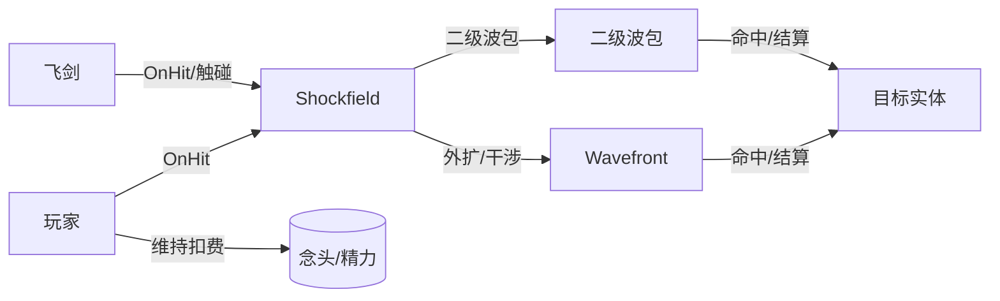
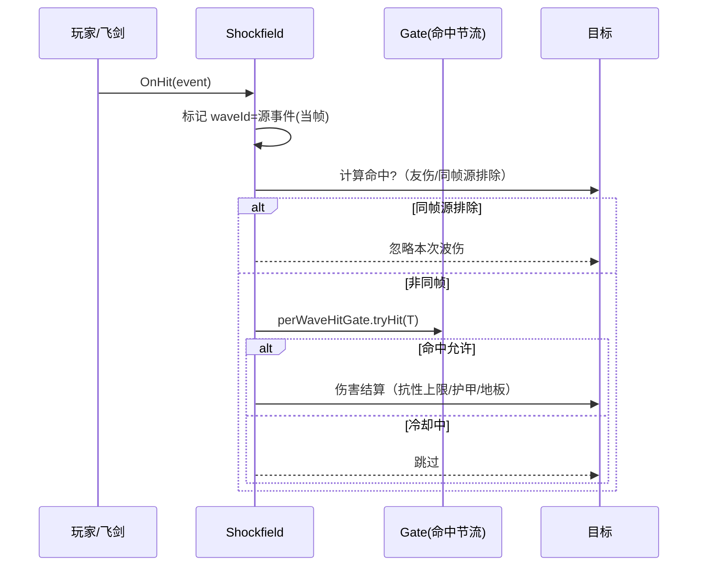
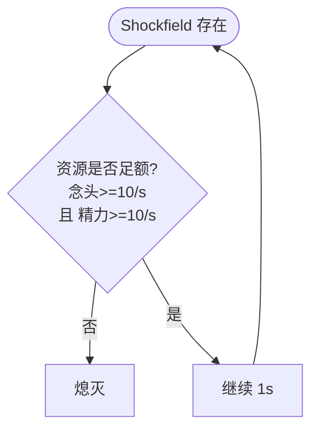

# 四转·剑荡蛊 · 需求方案（极简版）

> 目标：用需求视角描述“剑荡蛊（Shockfield）”的功能、参与者、流程与约束，便于评审与实现。尽量少代码，重描述与流程。

## 功能列表

- 波源触发与维持
  - OnHit 触发玩家/飞剑波源；维持态按秒扣费（念头/精力），资源不足即时熄灭。
- 波传播与参数演化
  - 圆形波前外扩；振幅指数衰减、周期渐慢；最小振幅阈值与寿命上限。
- 干涉与相位
  - 同相增强、反相减弱、正常三类；用于伤害倍率与视觉反馈。
- 命中与伤害结算
  - 友伤排除、同帧自波排除、目标-波命中节流；伤害包含抗性上限与护甲折算；DPS 软封顶。
- 二级波包与飞剑互动
  - 主圈触碰飞剑可在命中点生成二级波包；不耗真元/念头/精力，但损耗飞剑耐久（按最大耐久百分比）。
- 运行与性能保护
  - 限流（波包生成频率、命中节流）、寿命上限、软封顶，避免 PVP 泛滥与刷屏。

## 用例图（Use Case）

## 用户故事（User Stories）

- 作为近战玩家，我在命中时自动产生波源，对周围敌人造成有节奏的伤害，同时不伤及队友与自己。
- 作为飞剑流玩家，我希望飞剑被主圈触及能在命中点扩散次级波，从而形成“剑域”，但成本仅体现在飞剑耐久。
- 作为 PVP 管理者，我需要伤害有软封顶与命中节流，避免瞬时爆发过度。
- 作为性能关心者，我希望波包生成与寿命受到控制，粒子/音效克制。

## 业务流程（时序/流程）

### A. OnHit 触发与同帧排除

### B. 维持态与资源消费

## 关键规则（需求层）

- 友伤排除：所有者、同队实体、同属飞剑永不受伤。
- 自波连带排除：OnHit 当帧/同 tick 的“源 waveId”对 OnHit 目标本体伤害被忽略；所有者永久免疫自伤。
- 命中节流：同一“波/目标”间命中冷却 0.25s。
- 抗性与护甲：百分比减伤最多 60%；护甲按 0.04/点折算为固定减伤。
- 伤害地板：每次命中最低 0.20。
- 软封顶：聚合 DPS 超过 30*(1+JD/500) 的部分按 50% 计入。
- 寿命/幅度：Shockfield 最长 10s；振幅低于 0.02 熄灭。
- 飞剑成本：二级波包生成仅损耐久（最大耐久的 0.5%）。

## 关键公式（描述）

- 振幅衰减：A(t+Δt) = A(t) · e^(−k·Δt)，k=0.15/s
- 周期拉伸：P(t+Δt) = P(t) · (1 + s·Δt)，s=0.10/s
- 相位倍率：同相 1.25 / 正常 1.0 / 反相 0.75
- 核心伤害：D_core = A_eff · M_phase · (Base + JD·0.015 + STR·0.10 + FLOW·0.005 + WTier·1.0)
- 最终伤害：D_final = max( D_core · (1 − clamp(Resist,0,0.60)) − Armor·0.04 , 0.20 )
- 软封顶：DPS_agg 超过 30·(1 + JD/500) 的部分按 50% 计入

## 非功能性约束

- 性能：波包生成与命中检查限流；渲染与音效克制；避免日志刷屏。
- 同步：仅必要状态做网络同步；避免客户端早期类加载。
- 可测试性：把伤害结算/软封顶/节流等提炼为纯函数，使用 JUnit5 做单测。

