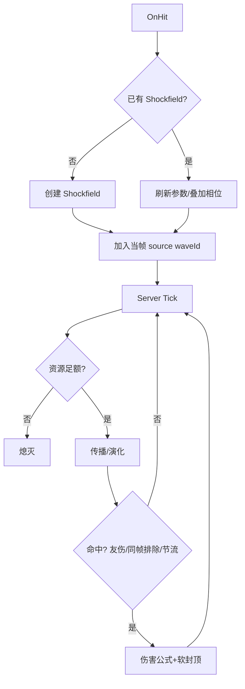

# 四转·剑荡蛊 · 技术框架（KISS/轻量）

> 基于“需求方案”输出实现侧框架设计，遵循 KISS 与轻量化：尽量复用既有 Ops 与 Registry，不引入新依赖。

## 核心原则

- 逻辑解耦：Shockfield 状态/传播/结算分层；纯逻辑可测试化。
- 统一助手：资源扣费用 `ResourceOps`；冷却用 `MultiCooldown`；护盾与属性统一 `AbsorptionHelper`。
- 事件接线：NeoForge 事件在 mod 构造器注册，不使用过时 FMLJavaModLoadingContext。

## 模块划分

- shockfield.api
  - 数据结构：WaveId、ShockfieldState、PhaseKind
  - 纯函数：DPS 软封顶、伤害公式、命中节流判定
- shockfield.runtime
  - 实例管理：创建/更新/熄灭；寿命/幅度演化；二级波包生成限流
  - Tick 驱动：服务器 Tick 汇总调度
- shockfield.integration
  - 资源/耐久：`ResourceOps.payPerSecond`、飞剑耐久消耗
  - 友伤/队伍：友军识别与排除

## 关键依赖与复用

- `MultiCooldown`：实现 perWave-perTarget 命中节流；key: `<waveId|targetUUID>`
- `ResourceOps`：每秒扣除念头/精力；任一不足立即熄灭
- `LedgerOps`：如涉及临时属性修正，集中增删，避免直接改底层通道

## 数据与常量

- 常量集中：docs/jiandanggu/config-constants.md（Markdown 常量清单，作为唯一参数来源）
- 序列化：仅持久 Shockfield 必要状态（开始时间、当前振幅/周期、持有者、限流器镜像）

## 交互与事件

- OnHit：玩家/飞剑命中 → 创建/刷新 Shockfield 源；标记当前 tick 的 source waveId
- Tick：更新 Shockfield；处理命中判定与伤害结算；资源扣费

## 流程图（实现视角）

## 版本与事件

- NeoForge 1.21.1：mod 总线监听器在构造器注册
- DoT Reaction：不直接耦合，本技能以直接伤害为主

## 测试策略

- 纯函数单测：
  - dpsCap、finalDamage、phaseMultiplier
  - perWaveHitGate（窗口/冷却）
- 运行时最小集成：
  - Shockfield 衰减与寿命边界
  - 资源扣费不足即熄灭

