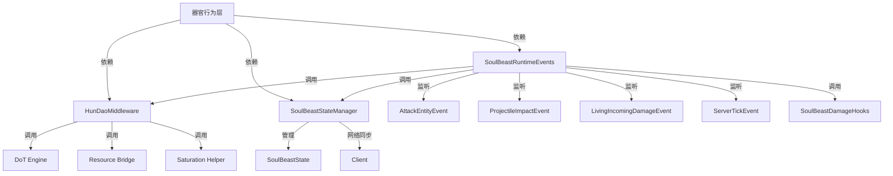

# Phase 0 完成报告：基线与观测

## 1. 执行摘要
- **阶段目标**：锁定 hun_dao 功能基线，建立可快速验证的测试机制
- **完成时间**：2025-11-17
- **执行人员**：AI Assistant
- **验收状态**：✅ 完成 / ⏳ 待人工测试验证

### 关键成果
- [x] 完成 hun_dao 包完整结构探索（28 个类）
- [x] 绘制依赖关系图（3 条关键路径）
- [x] 盘点核心功能清单（4 个器官 + 魂兽化系统）
- [x] 创建 smoke 测试脚本
- [ ] 执行 smoke 测试（待人工）

---

## 2. 依赖关系图

### 2.1 包结构概览
```
hun_dao/
├── item/hun_dao/
│   ├── HunDaoBalance.java           # 数值配置
│   ├── HunDaoClientAbilities.java   # 客户端能力注册
│   ├── HunDaoOrganRegistry.java     # 器官注册入口
│   ├── HunShouHuaConstants.java     # 魂兽化常量
│   ├── behavior/                    # 器官行为层（6 个类）
│   │   ├── DaHunGuBehavior.java
│   │   ├── GuiQiGuOrganBehavior.java
│   │   ├── GuiQiGuEvents.java
│   │   ├── HunDaoSoulBeastBehavior.java  # 核心执行器
│   │   ├── TiPoGuOrganBehavior.java
│   │   └── XiaoHunGuBehavior.java
│   ├── middleware/                  # 中间件层（2 个类）
│   │   ├── HunDaoMiddleware.java    # 核心桥梁 ★★★
│   │   └── HunDaoAuraHelper.java
│   └── combat/                      # 战斗层（1 个类）
│       └── HunDaoDamageUtil.java
├── item/synergy/hun_dao/
│   └── HunShouHuaSynergyBehavior.java  # 魂兽化仪式
└── util/hun_dao/soulbeast/          # Soul Beast 底层系统（17 个类）
    ├── SoulBeastRuntimeEvents.java  # 全局事件枢纽 ★★★
    ├── api/
    │   └── SoulBeastAPI.java
    ├── command/
    │   └── SoulBeastCommands.java
    ├── damage/                      # 伤害系统（3 个类）
    │   ├── SoulBeastDamageContext.java
    │   ├── SoulBeastDamageHooks.java
    │   └── SoulBeastDamageListener.java
    ├── state/                       # 状态管理（7 个类）
    │   ├── SoulBeastState.java
    │   ├── SoulBeastStateManager.java
    │   ├── SoulBeastStateEvents.java
    │   ├── SoulBeastRequestSyncPayload.java
    │   ├── SoulBeastSyncPayload.java
    │   └── event/
    │       └── SoulBeastStateChangedEvent.java
    └── storage/                     # 兽魂存储（3 个类）
        ├── BeastSoulStorage.java
        ├── BeastSoulRecord.java
        └── ItemBeastSoulStorage.java
```

### 2.2 核心依赖关系



### 2.3 关键路径详解

#### 路径 1：魂焰 DoT 流程

**触发条件**：魂兽玩家近战或远程攻击命中目标

```
1. 事件触发
   └─ SoulBeastRuntimeEvents.onMeleeHit() 或 onProjectileImpact()
      └─ 验证条件：
         ├─ 攻击者处于魂兽状态 (SoulBeastStateManager.isActive())
         ├─ 目标是活体生物
         └─ 拥有足够魂魄 (>= 18.0)

2. 资源扣减
   └─ ResourceOps.consumeHunpoStrict(attacker, 18.0)
      └─ 严格扣减模式（不回退到血量）

3. 伤害计算
   └─ computeSoulFlameDps(attacker)
      ├─ 读取 max_hunpo
      ├─ 计算联动加成 (LinkageChannel: hun_dao_increase_effect)
      └─ DoT = max_hunpo × 0.01 × (1 + 联动加成)

4. DoT 应用
   └─ HunDaoMiddleware.applySoulFlame(player, target, dot, 5秒)
      ├─ 标记"魂印"标签 (ReactionTagKeys.SOUL_MARK, 200 ticks)
      └─ DoTEngine.schedulePerSecond()
         ├─ 伤害类型：HUN_DAO_SOUL_FLAME
         ├─ 特效：soulbeast_dot_tick
         └─ 音效：CUSTOM_SOULBEAST_DOT
```

**关键文件位置**：
- `SoulBeastRuntimeEvents.java:58` (onMeleeHit)
- `SoulBeastRuntimeEvents.java:88` (onProjectileImpact)
- `SoulBeastRuntimeEvents.java:213` (computeSoulFlameDps)
- `HunDaoMiddleware.java:31` (applySoulFlame)

---

#### 路径 2：伤害转化流程

**触发条件**：魂兽玩家受到伤害

```
1. 事件监听 (LOWEST 优先级)
   └─ SoulBeastRuntimeEvents.onIncomingDamage()
      └─ 验证条件：
         ├─ 受害者处于魂兽状态
         ├─ 伤害未被取消
         ├─ 伤害源不在豁免标签中 (GRDamageTags.BYPASS_ORGAN_HOOKS)
         └─ 伤害值 > 0.001

2. 魂魄成本计算
   └─ baseHunpoCost = incomingDamage × 1.0
   └─ adjustedHunpoCost = SoulBeastDamageHooks.applyHunpoCostModifiers()
      └─ 应用修正器（例如：大魂蛊威灵 -10）

3. 魂魄扣减
   └─ drainHunpo(victim, adjustedHunpoCost)
      ├─ 读取当前魂魄值
      ├─ drain = min(available, requestedCost)
      └─ handle.adjustDouble("hunpo", -drain)

4. 剩余伤害计算
   └─ remainingDamage = (adjustedHunpoCost - drainedHunpo) / 1.0
   └─ finalDamage = applyPostConversionDamageModifiers(remainingDamage)
   └─ event.setAmount(finalDamage)
```

**伤害转化比例**：
- 基础转化率：1 伤害 = 1 魂魄消耗
- 修正器示例：
  - 大魂蛊威灵（魂兽状态）：-10 成本减免
  - 未来可扩展：护甲、抗性等

**关键文件位置**：
- `SoulBeastRuntimeEvents.java:132` (onIncomingDamage)
- `SoulBeastRuntimeEvents.java:185` (drainHunpo)
- `SoulBeastDamageHooks.java` (修正器注册表)

---

#### 路径 3：魂兽化仪式流程

**触发条件**：玩家装备小魂蛊和大魂蛊，执行魂兽化仪式

```
1. 装备验证
   └─ HunShouHuaSynergyBehavior.onSlowTick()
      └─ 检查条件：
         ├─ 装备小魂蛊 (xiao_hun_gu)
         ├─ 装备大魂蛊 (da_hun_gu)
         └─ 未使用过魂兽化 (尚未标记)

2. 仪式执行（需要人工触发命令或流程）
   └─ FlowController.start("hun_shou_hua")
      ├─ prepare 阶段：准备仪式
      ├─ channel 阶段：引导施法
      └─ success/fail 阶段：完成或失败

3. 状态切换
   └─ SoulBeastStateManager.setActive(player, true)
      ├─ 设置魂兽状态标志
      ├─ 设置来源器官 ID
      └─ 网络同步到客户端

4. 初始化资源
   └─ SoulBeastStateChangedEvent 触发
      └─ SoulBeastRuntimeEvents.onSoulBeastStateChanged()
         └─ 填充魂魄至最大值 (hunpo = zuida_hunpo)

5. 永久标记
   └─ 防止重复使用（仪式流程内部逻辑）
```

**关键文件位置**：
- `HunShouHuaSynergyBehavior.java` (仪式逻辑)
- `SoulBeastStateManager.java` (状态管理)
- `SoulBeastRuntimeEvents.java:236` (状态切换处理)

---

## 3. 功能基线清单

### 3.1 四个器官能力总结

#### 小魂蛊 (xiao_hun_gu)
**文件位置**：`item/hun_dao/behavior/XiaoHunGuBehavior.java`

| 能力类型 | 描述 | 数值 | 代码位置 |
|---------|------|------|---------|
| **被动恢复** | 每秒恢复魂魄 | +1.0 hunpo/s | XiaoHunGuBehavior:67 |
| **联动加成** | 无其他小魂蛊时提供联动权重 | +20% | XiaoHunGuBehavior:92-110 |

**常量定义**：
- `HunDaoBalance.XIAO_HUN_RECOVER = 1.0`
- `HunDaoBalance.XIAO_HUN_RECOVER_BONUS = 0.2`

---

#### 大魂蛊 (da_hun_gu)
**文件位置**：`item/hun_dao/behavior/DaHunGuBehavior.java`

| 能力类型 | 描述 | 数值 | 代码位置 |
|---------|------|------|---------|
| **被动恢复** | 每秒恢复魂魄和念头 | +2.0 hunpo/s, +1.0 niantou/s | DaHunGuBehavior:45-46 |
| **魂意** | 非魂兽状态，按魂道器官数量加成恢复 | 每个器官 +0.75%，最多 +15% | DaHunGuBehavior:47-48 |
| **威灵（震慑）** | 魂兽状态，8 格范围震慑敌对生物 | HP < 魂魄值 → 震慑 100 ticks | DaHunGuBehavior:96-99 |
| **威灵（减免）** | 魂兽状态，魂道攻击消耗减免 | -10 hunpo cost | DaHunGuBehavior:202-206 |

**常量定义**：
- `BASE_HUNPO_RECOVERY_PER_SECOND = 2.0`
- `BASE_NIANTOU_RECOVERY_PER_SECOND = 1.0`
- `SOUL_INTENT_PER_ORGAN = 0.0075`
- `SOUL_INTENT_MAX = 0.15`
- `WEILING_ATTACK_COST_REDUCTION = 10.0`
- `WEILING_RADIUS = 8.0`

---

#### 鬼气蛊 (gui_qi_gu)
**文件位置**：`item/hun_dao/behavior/GuiQiGuOrganBehavior.java`

| 能力类型 | 描述 | 数值 | 代码位置 |
|---------|------|------|---------|
| **被动恢复** | 每秒恢复魂魄和精力 | +3.0 hunpo/s, +1.0 jingli/s | GuiQiGuOrganBehavior |
| **真伤** | 近战附加真实伤害 | max_hunpo × 0.03 | GuiQiGuOrganBehavior |
| **主动：鬼雾** | 释放 4 格黑雾，造成缓慢 IV + 失明 | 冷却 160 ticks | GuiQiGuOrganBehavior |
| **噬魂** | 击杀目标时增加魂魄上限 | 12% 概率触发 | GuiQiGuOrganBehavior |

---

#### 体魄蛊 (ti_po_gu)
**文件位置**：`item/hun_dao/behavior/TiPoGuOrganBehavior.java`

| 能力类型 | 描述 | 数值 | 代码位置 |
|---------|------|------|---------|
| **被动恢复** | 每秒恢复魂魄和精力 | +3.0 hunpo/s, +1.0 jingli/s | TiPoGuOrganBehavior |
| **子魂** | 非魂兽状态，无其他体魄蛊时提供联动加成 | +10% | TiPoGuOrganBehavior |
| **护盾** | 每 200 tick 刷新护盾 | max_hunpo × 0.005 × (1 + 子魂) | TiPoGuOrganBehavior |
| **真伤** | 魂兽状态，近战真伤并消耗魂魄 | max_hunpo × 0.03, cost = max_hunpo × 0.001 | TiPoGuOrganBehavior |

---

### 3.2 魂兽化系统

#### 核心资源管理

| 资源 | 说明 | 管理位置 |
|------|------|---------|
| **魂魄 (hunpo)** | 战斗与生存核心资源 | GuzhenrenResourceBridge |
| **最大魂魄 (zuida_hunpo)** | 魂魄上限，影响 DoT 伤害 | GuzhenrenResourceBridge |
| **念头 (niantou)** | 辅助资源（大魂蛊生成） | GuzhenrenResourceBridge |
| **精力 (jingli)** | 辅助资源（鬼气蛊/体魄蛊生成） | GuzhenrenResourceBridge |

#### 魂兽状态

| 状态 | 说明 | 管理位置 |
|------|------|---------|
| **魂兽标志 (isSoulBeast)** | 是否处于魂兽化状态 | SoulBeastStateManager |
| **来源器官 (source)** | 触发魂兽化的器官 ID | SoulBeastStateManager |
| **魂魄泄露** | 魂兽状态每秒泄露 3.0 魂魄 | SoulBeastRuntimeEvents:123 |
| **饱食维护** | 自动补充饱和度至 18，+0.5 饱食 | HunDaoMiddleware:74, :96 |

#### 特殊机制

| 机制 | 说明 | 位置 |
|------|------|------|
| **魂焰 DoT** | 攻击触发持续真伤 | SoulBeastRuntimeEvents:58, :88 |
| **伤害转化** | 受击时魂魄吸收伤害 | SoulBeastRuntimeEvents:132 |
| **DoT 清理** | 退出魂兽状态时清除所有待发射的 DoT | SoulBeastRuntimeEvents:254-261 |
| **魂印标签** | DoT 附带标签，触发反应规则 | HunDaoMiddleware:45-47 |

---

## 4. Smoke 测试结果

### 测试场景 1：魂兽化仪式
**状态**：⏳ 待人工测试

**预期结果**：
- [ ] 魂兽状态标志设置为 true
- [ ] 魂魄值填充至最大值
- [ ] 客户端同步成功（视觉反馈）

---

### 测试场景 2：魂魄生成与消耗
**状态**：⏳ 待人工测试

**预期结果**：
- [ ] 小魂蛊每秒 +1.0 魂魄
- [ ] 大魂蛊每秒 +2.0 魂魄
- [ ] 魂兽状态每秒泄露 -3.0 魂魄
- [ ] 近战攻击扣减 18.0 魂魄（大魂蛊威灵 -10）

---

### 测试场景 3：魂焰 DoT
**状态**：⏳ 待人工测试

**预期结果**：
- [ ] 近战命中触发魂焰
- [ ] DoT 持续 5 秒
- [ ] 伤害值 = max_hunpo × 0.01 × (1 + 联动加成)
- [ ] 目标附带"魂印"标签

---

### 测试场景 4：伤害转化
**状态**：⏳ 待人工测试

**预期结果**：
- [ ] 受击时魂魄扣减
- [ ] 扣减量 = 伤害值 × 1.0
- [ ] 剩余伤害 = (成本 - 已扣) / 1.0
- [ ] 魂魄不足时受到完整伤害

---

## 5. 遗留问题与风险

### 5.1 架构问题
| 问题 | 影响 | 优先级 |
|------|------|--------|
| 行为类直接依赖 HunDaoMiddleware 等具体实现 | 耦合严重，难以测试 | P1 |
| 数值常量散落在各行为类 | 难以统一调参 | P1 |
| 客户端逻辑混在行为类中 | 服务端/客户端职责不清 | P2 |
| 缺乏单元测试 | 回归风险高 | P1 |
| 文档不足 | 维护成本高 | P3 |

### 5.2 功能风险
| 风险 | 概率 | 应对措施 |
|------|------|----------|
| 魂魄泄露过快导致体验不佳 | 中 | Phase 4 引入数值测试，可调整 HUNPO_LEAK_PER_SEC |
| DoT 伤害计算错误 | 低 | Phase 4 添加单元测试覆盖 computeSoulFlameDps |
| 伤害转化比例失衡 | 中 | Phase 4 参数化 HUNPO_PER_DAMAGE，支持动态调整 |
| 魂兽化仪式条件过于严格 | 低 | 已有防止重复使用的机制，无需调整 |

---

## 6. 下一步建议

### Phase 1 准备（包结构与接口骨架）

#### 6.1 目录规划
基于 `jian_dao` 成熟架构，建立以下目录：

```
hun_dao/
├── behavior/
│   ├── active/      # 主动技能（例如：鬼雾）
│   ├── passive/     # 被动能力（例如：魂魄恢复）
│   ├── organ/       # 器官核心行为（例如：大魂蛊、小魂蛊）
│   ├── skills/      # 复杂技能组合
│   └── common/      # 共享上下文与守卫
├── runtime/         # 运行时状态管理
│   ├── HunDaoRuntimeContext.java
│   ├── HunDaoStateMachine.java
│   └── HunPoDrainScheduler.java
├── calculator/      # 数值计算
│   ├── HunDaoDamageCalc.java
│   └── HunPoScalingCalc.java
├── tuning/          # 调参配置
│   ├── HunDaoTuning.java
│   └── HunDaoCombatTuning.java
├── fx/              # 特效系统
│   ├── HunDaoFxRouter.java
│   └── HunDaoFxTuning.java
├── client/          # 客户端注册
│   └── HunDaoClientRegistries.java
├── events/          # 事件处理
│   └── HunDaoEventRouter.java
├── ui/              # UI 组件
│   └── HunDaoSoulHud.java
└── storage/         # 持久化
    ├── HunDaoSoulStateStore.java
    └── HunDaoAttachmentKeys.java
```

#### 6.2 接口设计

**HunDaoResourceOps** (接口)
```java
public interface HunDaoResourceOps {
    boolean consumeHunpo(Player player, double amount);
    void leakHunpoPerSecond(Player player, double amount);
    double readHunpo(Player player);
    double readMaxHunpo(Player player);
}
```

**HunDaoFxOps** (接口)
```java
public interface HunDaoFxOps {
    void playSoulFlameFx(LivingEntity target);
    void playTransformFx(Player player);
    void playAuraFx(Player player, double radius);
}
```

**HunDaoNotificationOps** (接口)
```java
public interface HunDaoNotificationOps {
    void notifyInsufficientHunpo(Player player, double required, double current);
    void notifyTransformSuccess(Player player);
    void notifyTransformFailed(Player player, String reason);
}
```

#### 6.3 迁移策略
1. 创建接口与临时实现（适配器模式包装现有 HunDaoMiddleware）
2. 逐步替换行为类的直接依赖为接口依赖
3. 验证编译通过 + smoke 测试不回归
4. Phase 2 再实现真正的分离式存储与运行时

---

## 7. 文档完成检查清单

- [x] 依赖关系图覆盖 3 条关键路径
- [x] 功能基线清单包含所有现有功能，标注代码位置
- [x] Smoke 测试脚本已创建（见 `smoke_test_script.md`）
- [ ] 测试结果记录完整（待人工测试后填写）
- [x] 建立计划-报告-审查模板

---

## 8. 附件

- `Phase0_Plan.md`：详细任务清单与时间表
- `smoke_test_script.md`：手动测试场景与验证标准
- `Phase0_Review.md`：待审查模板（供人工填写）

---

**报告生成时间**：2025-11-17
**下一步**：等待人工执行 smoke 测试，填写测试结果后提交审查
